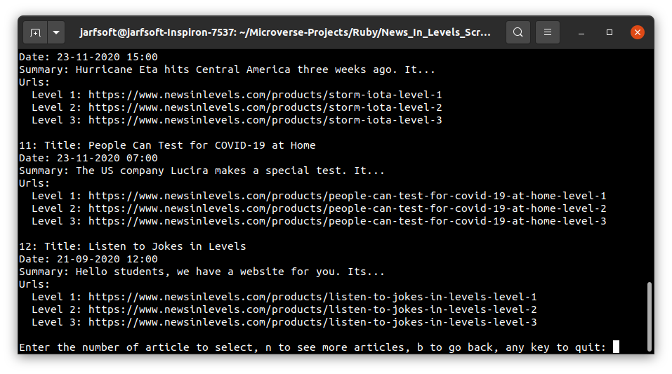

# Ruby Scraper Capstone

 In this project, I created a scraper script that obtains the newest articles from `hhttps://www.newsinlevels.com/` and shows the data in the terminal. It lets the user to choose one of the articles and then the reading level and finally it prints the article.
 I think it is a very fun way to browse the articles in the page.

## Built With

- Ruby

Gems:

- HTTParty
- Nokogiri

### Prerequisites

- Ruby Installed

### Setup

- Open your terminal and go to the directory where you want to clone the repo.

- Clone the repository to your local machine. Type `$ git clone https://github.com/Jarfsoft/News_In_Levels_Scraper.git`

- Go to the Ruby_Scraper_Capstone directory. Type `$ cd News_In_Levels_Scraper`

- Install bundler. Type `$ gem install bundler`

- Install the necessary gems to run the scraper. Type `$ bundle install`

- Now your environment is ready to run the scraper. Type `$ ruby bin/main.rb`

### Using the scraper

- When you run the scraper you'll see the list of articles. It'll show up to 12.

- You can enter the corresponding number for the article you want to read, enter "n" to see the next batch of artcles (some of them are going to be reapeted), enter "b" to go back to the previous batch, or any other key to end the program.

- When you choose the article you'll be able to choose the reading level by entering the corresponding number or any other key to go back to the firt list.

### Run tests

- Just type the command `rspec` in your terminal to check the results of the tests.

## Author

👤 **Julian Ramos**

- GitHub: [@Jarfsoft](https://github.com/Jarfsoft)
- Twitter: [@Jarfsoft](https://twitter.com/Jarfsoft)
- LinkedIn: [Juan Andrés Raudales Flores](https://www.linkedin.com/in/juan-raudales-flores-7b0a3b113/)

## 🤝 Contributing

Contributions, issues, and feature requests are welcome!

Feel free to check the [issues page](https://github.com/julian3493/Ruby_Scraper_Capstone/issues).

## Show your support

Give a ⭐️ if you like this project!

## Acknowledgments

- The Odin Project